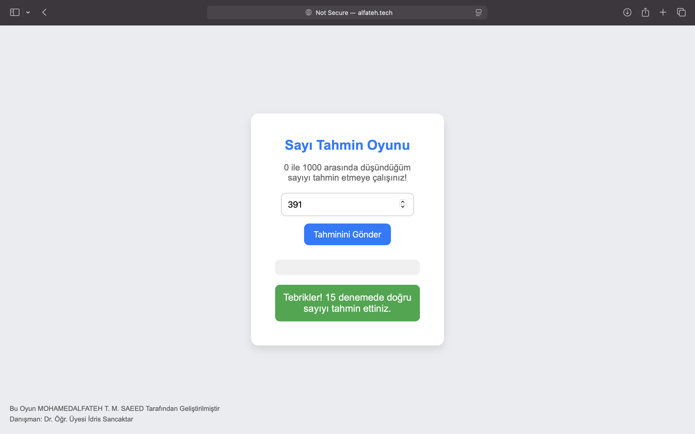
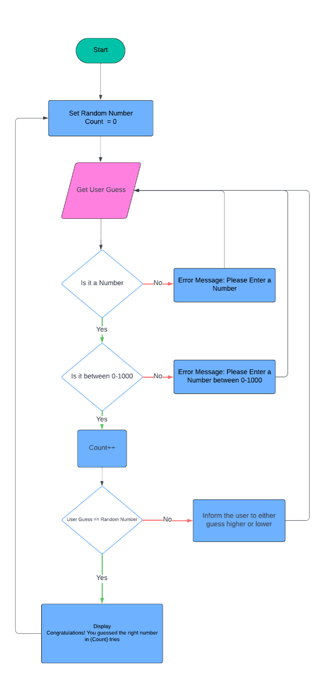

# Sayı Tahmin Oyunu - Flask Uygulaması


Bu proje, Flask çerçevesini kullanarak geliştirilen basit bir **Sayı Tahmin Oyunu** web uygulamasıdır. Oyunun amacı, 0 ile 1000 arasında rastgele bir sayı seçilip kullanıcının bu sayıyı tahmin etmeye çalışmasıdır. Her tahminde geri bildirim verilerek kullanıcıya doğru sayıyı bulması konusunda yardımcı olunur. Doğru tahmin yapıldığında, kaç denemede sayının bulunduğu ekranda gösterilir.

## Demo

Canlı demo için: [www.alfateh.tech](http://www.alfateh.tech)

## Proje Özeti

- **Teknolojiler**: Python, Flask, HTML, CSS, JavaScript
- **Özellikler**:
  - 0 ile 1000 arasında rastgele bir sayı oluşturulur.
  - Kullanıcıya her tahmin sonrası geri bildirim verilir: daha yüksek veya daha düşük tahmin yapması gerektiği belirtilir.
  - Kullanıcı doğru tahmini yaptığında, kaç denemede bulduğunu gösterir ve oyun sıfırlanarak yeniden başlar.
  - Oturum yönetimi ile her kullanıcı için ayrı bir rastgele sayı ve deneme sayısı tutulur.

## Program Akışı



## Kurulum Adımları

1. **Depoyu klonlayın**:
    ```bash
    git clone https://github.com/FatihSir/Machine-Learning.git
    ```

2. **Gereksinimleri yükleyin**:
    ```bash
    pip install -r requirements.txt
    ```

3. **Uygulamayı çalıştırın**:
    ```bash
    python guess.py
    ```

4. **Tarayıcıda açın**:
    Uygulamanın çalıştığı adresi tarayıcınızda açın: `http://127.0.0.1:5000`

## Proje Dosya Yapısı

```bash
.
├── guess.py                  # Ana Flask uygulaması
├── templates
│   └── index.html           # Ana HTML dosyası
├── static
│   ├── main.js              # JavaScript dosyası
│   └── styles.css           # CSS dosyası
├── requirements.txt         # Gerekli kütüphaneler
└── README.md                # Proje açıklaması

